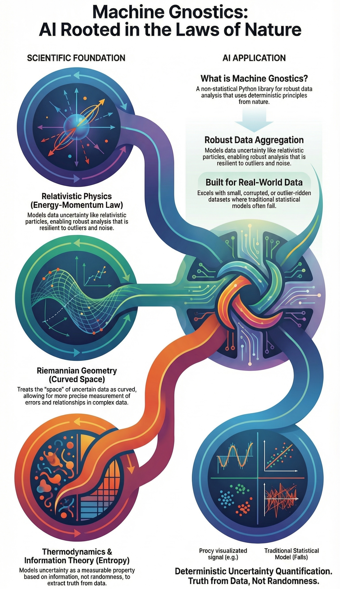

# Machine Gnostics
*AI Rooted in the Laws of Nature*

!!! abstract "Revolutionary Framework"
    **Machine Gnostics** represents the world's first comprehensive non-statistical machine learning framework, fundamentally challenging traditional AI by encoding the laws of nature directly into algorithms.

<figure markdown="span">
    
    <figcaption>Machine Gnostics: Scientific Foundation & AI Application</figcaption>
</figure>

## Foundation Principles

  

    

      <h3>Scientific Foundation</h3>
    

    

      <ul>
        <li><strong>Relativistic Physics</strong> - Energy-momentum law for data modeling</li>
        <li><strong>Riemannian Geometry</strong> - Curved space for uncertainty quantification</li>
        <li><strong>Thermodynamics</strong> - Information theory and entropy principles</li>
        <li><strong>Universal Bounds</strong> - Mathematical constraints from nature</li>
      </ul>
    

  

  

    

      <h3>Non-Statistical Architecture</h3>
    

    

      <ul>
        <li><strong>Deterministic Principles</strong> - Data as measurable, material causes</li>
        <li><strong>Small Data Excellence</strong> - Works regardless of dataset size</li>
        <li><strong>Noise Resilience</strong> - Exceptional outlier and corruption resistance</li>
        <li><strong>Truth Extraction</strong> - Data speaks for themselves</li>
      </ul>
    

  

## Core Capabilities

  

    <h4>Robust Data Aggregation</h4>
    
Models data uncertainty like relativistic particles, enabling robust analysis that is resilient to outliers and noise.

  

  

    <h4>Real-World Data Excellence</h4>
    
Excels with small, corrupted, or outlier-ridden datasets where traditional statistical models often fail.

  

  

    <h4>Deterministic Uncertainty</h4>
    
Treats uncertainty as measurable property based on information, not randomness - truth from data, not assumptions.

  

  

    <h4>Entropy Minimization</h4>
    
Minimizes entropy rather than squared error for model convergence - a unique trait that aligns with thermodynamic principles and information theory.

  

<!-- ## Applications

  

    <h4>Engineering & Manufacturing</h4>
    
Thermal system optimization, quality control processes, and predictive maintenance where traditional statistical approaches struggle with limited data or high noise environments.

  

  

    <h4>Energy Systems</h4>
    
Heat transfer analysis, power generation efficiency, and renewable energy optimization, leveraging deep integration with thermodynamic principles.

  

  

    <h4>Scientific Research</h4>
    
Materials characterization, experimental data analysis, and hypothesis testing where physical laws provide stronger constraints than statistical assumptions.

  

  

    <h4>Process Industries</h4>
    
Chemical engineering applications, pharmaceutical development, and biotechnology where deterministic relationships govern system behavior.

  

 -->

## Technical Excellence

!!! note "Mathematical Foundation"
    Machine Gnostics, based on Mathematical Gnostics, implements advanced mathematical concepts including vector bi-algebra, non-Euclidean geometries (Riemannian, Minkowskian), and quantification theory as foundational measurement science.

  

    <h4>Small Data Mastery</h4>
    
Extracts truth from data regardless of sample size, delivering insights from minimal datasets without statistical assumptions.

  

  

    <h4>Physical Constraint Recognition</h4>
    
Understands causality, physical constraints, and engineering principles embedded in data structures.

  

  

    <h4>Exceptional Robustness</h4>
    
Delivers exceptional resilience against outliers, noise, and corrupted data through deterministic geometric modeling.

  

  

    <h4>Universal Mathematical Bounds</h4>
    
Natural [0, ∞] constraints from physical laws ensure realistic, interpretable results in all applications.

  

## MAGNET Deep Learning Framework

!!! tip "Next Generation AI"
    **MAGNET (Machine Gnostics Networks)** represents the next frontier - applying gnostic principles to neural network architectures for interpretable, robust deep learning models.

  <!-- 

    <h4>Interpretable Networks</h4>
    
Neural architectures that maintain physical interpretability while delivering deep learning performance.

  
 -->

  

    <h4>Physics-AI Integration</h4>
    
Seamlessly bridges traditional deep learning with physics-based modeling principles.

  

  

    <h4>Reliable Standards</h4>
    
Establishes new benchmarks for trustworthy, nature-inspired artificial intelligence systems.

  

## Open Source Leadership

!!! heart "Community Driven"
    Machine Gnostics is proudly open source, democratizing access to revolutionary AI methodologies and fostering global collaboration in advancing non-statistical machine learning.

  

    <h4>Global Accessibility</h4>
    
Freely accessible codebase with comprehensive documentation, making advanced mathematical concepts available to researchers worldwide.

  

  

    <h4>Industrial Integration</h4>
    
Seamless integration with standard ML workflows including MLflow, enabling easy adoption in existing data science pipelines.

  

  

    <h4>Educational Mission</h4>
    
Building international network of researchers and practitioners while making advanced AI concepts accessible to broader audiences.

  

  

    <h4>AI Paradigm Shift</h4>
    
Brings revolutionary change to AI by requiring a different lens to view data and data science problems, moving beyond traditional statistical thinking.

  

## Scientific Impact

> *"Let data speak for themselves"*

This core philosophy reflects Dr. Parmar's vision of AI that respects data individuality, leverages nature's laws, and operates effectively in the real world without idealized statistical assumptions. Machine Gnostics has gained recognition from leading researchers who have solved previously "unsolvable" problems using the framework.

  <a href="https://www.machinegnostics.info/" class="mg-link-secondary">
    Explore Machine Gnostics
  </a>
  <a href="https://github.com/MachineGnostics/machinegnostics" class="mg-link-secondary">
    GitHub Repository
  </a>
  <a href="https://pypi.org/project/machinegnostics/" class="mg-link-secondary">
    PyPI Package
  </a>

