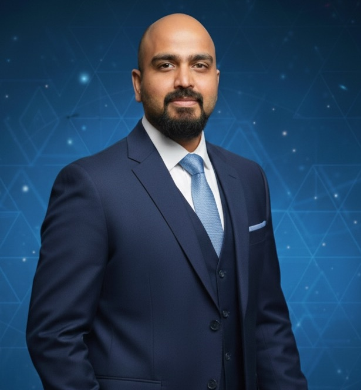

---
hide:
  - navigation
  - toc
---

Director - Data Analytics & AI · Novartis

# Dr. Nirmal Parmar

**Research scientist & AI innovator** bridging thermal engineering and non-statistical artificial intelligence. Founder of [Machine Gnostics](https://www.machinegnostics.info/) — the world's first non-statistical ML library.

[:material-email-outline: Get in touch](contact.md){ .md-button .md-button--primary }
[:fontawesome-brands-linkedin: LinkedIn](https://www.linkedin.com/in/nirmal-parmar-phd-3a440037){ .md-button target="_blank" }

{ .hero-photo }

---

10+

Years in AI & engineering

20+

Research publications

3

PhD institutions

#1

Non-statistical ML library

---

## What makes this work different

> **Redesigning the mathematical core of AI.**
> Most AI relies on large datasets and statistical assumptions. Machine Gnostics encodes geometry, physics, and entropy directly into algorithms — delivering reliable results even from small, noisy, real-world data.

[Explore Machine Gnostics :material-arrow-right:](https://www.machinegnostics.info/){ .md-button target="_blank" }

---

## How I can help you

:material-flask-outline:{ .service-icon }

**Research collaboration**

Joint research with universities and institutes on AI, non-statistical methods, and thermal engineering applications.

[Let&#39;s connect](contact.md)

:material-briefcase-outline:{ .service-icon }

**Industry consultancy**

Enterprise AI strategy, digital transformation, and small-data AI solutions that work on real-world industrial data.

[Let&#39;s connect](contact.md)

:material-microphone-outline:{ .service-icon }

**Speaking & mentorship**

Keynotes, PhD/postdoc supervision, and career coaching at the intersection of AI and engineering.

[Let&#39;s connect](contact.md)

---

## Connect with me

## Collaborations

!!! success "Collaboration Opportunities"

    Dr. Parmar welcomes collaboration with forward-thinking organizations, research institutions, and individual researchers who are ready to explore the transformative potential of non-statistical AI in engineering and business applications.

    [Get in Touch](contact.md)

    [Explore Machine Gnostics](ai-mg.md)

---

!!! quote "Mission Statement"

    *"Redesigning the mathematical core of AI. - Machine Gnostics"*

    **- Dr. Nirmal Parmar**
